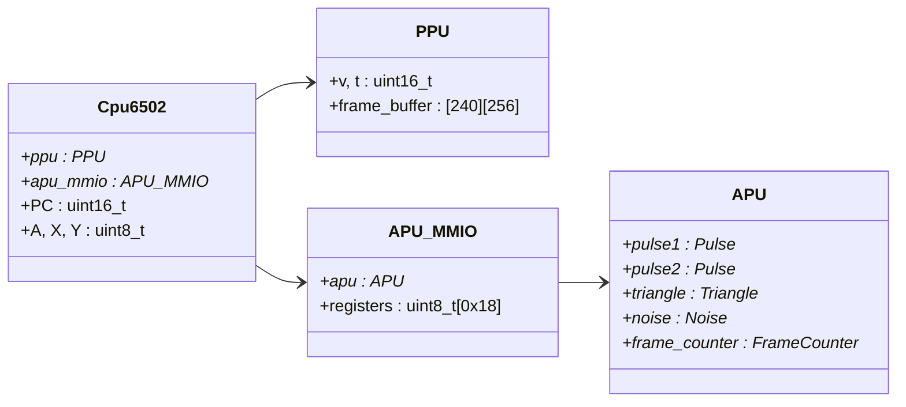
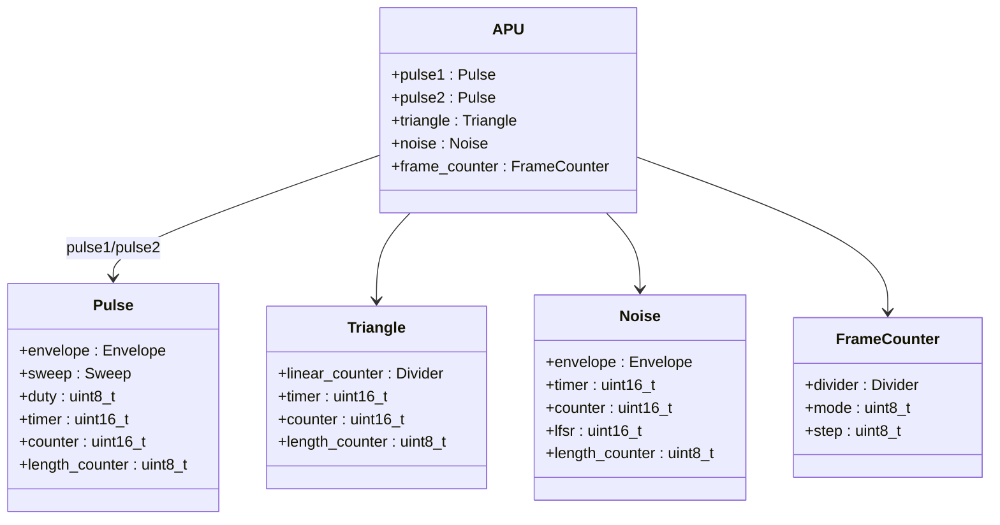
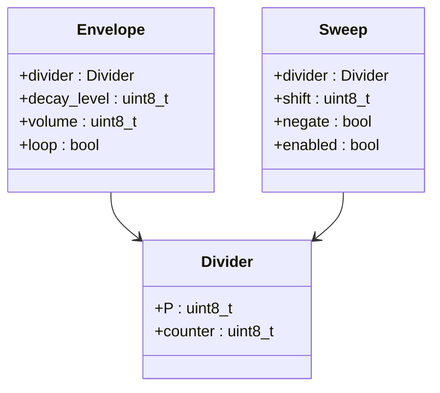

# NES

This is my implementation of an NES emulator written in C.

## TODO
- [ ] Rendering
  - [x] 8x8 sprite rendering
  - [ ] 8x16 sprite rendering
  - [x] Horizontal sprite flipping
  - [x] Vertical sprite flipping
  - [x] Background rendering
  - [x] Sprite-background priority handling
  - [ ] Sprite overflow / sprite zero hit detection
- [ ] Audio support
  - [x] Pulse Channels
  - [x] Triange Channel
  - [x] Noise Channel
  - [ ] DMC
- [ ] Mapper support
  - [x] NROM / mapper 0

## Project Structure







## Usage

### Requirements
The following items are required for this program to function:

- gcc/clang
- SDL2 

### Building

Git clone the repository with the following command: 

```
git clone https://github.com/KavinTheG/chip8.git
```

Change directory to my chip8 project directory

```
cd NES
```

Enter the following command to build the project

```
make
```

This will create a binary file located in the bin/ folder. Currently, I am only testing on the nes-test.nes rom and donkey kong rom. Place the respective rom files in test/ or rom/. Run the command below to execute.

```
./bin/emulator
```

### Progress 
Able to run Donkey Kong with minor issues.


## References

- https://www.nesdev.org/wiki/Nesdev_Wiki
